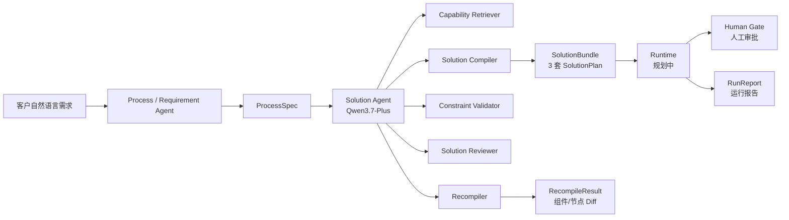

# DCForge

**Solution-as-Code 客户解决方案编译与价值验证引擎**

DCForge 将客户的自然语言需求转化为结构化 `ProcessSpec`，通过 Solution Agent 调用确定性工具链，生成 conservative、balanced、innovative 三套 `SolutionPlan`，支持硬约束校验、多维方案评审和增量重编译。下游 Runtime 可执行选定方案并生成人工审批节点和运行报告。

## 项目背景

传统客户解决方案设计存在以下问题：

- **需求表达不结构化**：客户口述需求难以直接转化为可执行方案；
- **方案依赖人工经验**：方案质量受顾问个人能力影响大；
- **方案变更难追踪**：约束变化后难以快速评估影响范围；
- **合规和安全约束容易遗漏**：硬约束在方案设计阶段常被忽略；
- **方案价值难量化**：缺乏设计阶段的可解释评分机制。

DCForge 的核心思路：

```
ProcessSpec → SolutionBundle → RunReport
```

将需求结构化、方案编译、约束校验、方案评审和增量重编译形成确定性工具链，由 Solution Agent 统一调度，使方案生成过程可解释、可追踪、可复现。

## 核心能力

| 能力 | 说明 |
|---|---|
| **ProcessSpec 结构化需求合同** | Pydantic 公共合同，含行业、部门、痛点、约束、目标指标等 15 个字段 |
| **15 个能力胶囊** | 覆盖文档抽取、知识检索、规则引擎、异常分类、风险评分、数据脱敏、人工审批、工单路由、审计日志等 |
| **确定性组件检索** | 基于行业、部门、痛点、数据和约束的可解释评分匹配 |
| **三档方案编译** | conservative（低风险人工可控）/ balanced（综合权衡）/ innovative（高度自动化） |
| **硬约束校验** | 支持 approval / security / data / risk / budget / time 六种约束类型 |
| **多维 Reviewer** | 约束合规(30) + 需求覆盖(25) + 工作流完整性(20) + 可解释性(15) + 可行性(10) |
| **增量重编译** | 新增约束后生成 `RecompileResult`，含组件 Diff、节点 Diff 和变更说明 |
| **Qwen Solution Agent** | 使用 qwen3.7-plus 进行意图识别、约束结构化和工具调度 |
| **工具调用轨迹** | 每次 Agent 执行记录 `AgentToolCall`，含步骤、工具名、状态和摘要 |
| **跨场景自适应** | 7 种场景识别（incident_response / fraud_risk / identity_account / dispute_investigation / customer_service / procurement_exception / generic） |
| **human_gate 人工审批语义** | human-approval 节点统一 `human_gate=true`，gate_reason 按场景生成 |
| **FastAPI 服务接口** | 5 个 RESTful 端点，支持 Swagger 文档 |

## 系统架构



> **注**：Runtime 模块和前端界面当前为规划阶段，尚未实现。Solution 模块已完整交付。

## 快速开始

### 环境要求

- Python 3.11+
- Windows / macOS / Linux

### 安装

```bash
# 克隆仓库
git clone https://github.com/pengfeidu09-tech/dc-forge.git
cd dc-forge

# 创建虚拟环境
python -m venv .venv

# Windows
.venv\Scripts\activate
# macOS / Linux
source .venv/bin/activate

# 安装依赖
pip install -r requirements.txt
```

### 启动 API 服务

```bash
.venv/Scripts/python.exe -m uvicorn backend.app.main:app --host 127.0.0.1 --port 8000
```

启动后访问：

- Swagger 文档：http://127.0.0.1:8000/docs
- 健康检查：http://127.0.0.1:8000/health

### 配置 Solution Agent（可选）

如需使用真实大模型 Agent，配置环境变量：

```bash
# Windows PowerShell
$env:LLM_API_KEY = "your-api-key"
$env:LLM_BASE_URL = "https://dashscope.aliyuncs.com/compatible-mode/v1"
$env:LLM_MODEL = "qwen3.7-plus"
```

不配置时，Agent 自动回退到确定性 `compile_solution`，所有测试仍可通过。

详细配置说明见 [docs/solution-agent-setup.md](docs/solution-agent-setup.md)。

## API 接口

| 方法 | 路径 | 输入 | 输出 | 说明 |
|---|---|---|---|---|
| GET | `/health` | — | `{"status": "ok", "service": "dcforge-solution"}` | 健康检查 |
| POST | `/compile-solution` | `CompileRequest` | `SolutionBundle` | 编译三套方案 |
| POST | `/recompile-solution` | `RecompileRequest` | `RecompileResult` | 增量重编译 |
| POST | `/review-solution` | `ReviewRequest` | `SolutionReviewResult` | 评审单套方案 |
| POST | `/agent/solution` | `AgentRequest` | `AgentResponse` | Solution Agent（LLM 调度） |

### 示例：编译方案

```bash
curl -X POST http://127.0.0.1:8000/compile-solution \
  -H "Content-Type: application/json" \
  -d "{\"process\": $(cat data/fixtures/process_spec.json)}"
```

更多示例见 [docs/b-solution-api-examples.md](docs/b-solution-api-examples.md)。

## 项目结构

```
dc-forge/
├── backend/
│   └── app/
│       ├── main.py                  # FastAPI 应用入口
│       ├── contracts/               # 公共 Pydantic 合同（不可修改）
│       │   ├── common.py            # BusinessConstraint
│       │   ├── process.py           # ProcessSpec, PainPoint, ProcessNode
│       │   ├── solution.py          # SolutionBundle, SolutionPlan, ComponentRef, WorkflowNode, ...
│       │   └── runtime.py           # RuntimeRequest, RunReport
│       ├── process/                 # Process Agent（规划中）
│       ├── runtime/                 # Runtime 执行器（规划中）
│       └── solution/                # Solution 模块（已完整实现）
│           ├── agent.py             # Solution Agent
│           ├── api.py               # FastAPI 路由
│           ├── capabilities.py      # CapabilityCapsule 模型 + 加载器
│           ├── compiler.py          # 场景自适应三套方案编译器
│           ├── constraints.py       # 硬约束校验器
│           ├── llm_provider.py      # OpenAI 兼容 LLM Provider
│           ├── recompiler.py        # 增量重编译器
│           ├── retriever.py         # 确定性组件检索器
│           ├── reviewer.py          # 多维方案 Reviewer
│           ├── scenario.py          # 场景识别与场景化数据
│           └── service.py           # 服务入口
├── data/
│   ├── capabilities.json            # 15 个能力胶囊
│   ├── procurement_cases.json       # 采购案例数据
│   └── fixtures/                    # 联调 Demo 数据
│       ├── process_spec.json        # 采购场景 ProcessSpec
│       ├── solution_bundle.json     # 三套方案 SolutionBundle
│       ├── solution_quality_report.json  # 质量报告
│       ├── recompile_request.json   # 重编译请求
│       ├── recompile_result.json    # 重编译结果
│       └── run_report.json          # RunReport 合同示例
├── docs/                            # 联调文档和 API 示例
├── spec/                            # SDD 规格文档
│   ├── governance/                  # 治理规则
│   └── implemented/                 # 已实现规格（B-M1 ~ B-M7）
├── tests/
│   ├── test_contracts.py            # 公共合同测试
│   └── solution/                    # Solution 模块测试（17 个文件）
├── scripts/
│   └── smoke_solution_agent.py      # 真实 API 冒烟脚本
├── .env.example                     # 环境变量模板
├── AGENTS.md                        # Agent 开发规则
├── requirements.txt                 # Python 依赖
└── README.md
```

## 公共合同

所有模块间交互使用 Pydantic 公共合同，位于 `backend/app/contracts/`：

| 合同 | 用途 | 关键字段 |
|---|---|---|
| `ProcessSpec` | 成员 A → B 的需求输入 | project_id, industry, department, business_goal, pain_points, constraints, target_metrics |
| `BusinessConstraint` | 客户约束 | id, type(approval/security/data/risk/budget/time), statement, hard, parameters |
| `SolutionBundle` | B → C 的方案输出 | project_id, plans(3 套 SolutionPlan) |
| `SolutionPlan` | 单套方案 | solution_id, plan_type, selected_components, to_be_nodes, review_score, warnings |
| `ComponentRef` | 选中的能力组件 | component_id, name, reason, required_data, evidence_urls |
| `WorkflowNode` | 流程节点 | id, name, component_id, executor(ai/human/system), next_ids, human_gate, gate_reason |
| `RecompileRequest` | 重编译请求 | process, selected_solution, new_constraints |
| `RecompileResult` | 重编译结果 | previous_solution_id, new_solution, added/removed_component_ids, changed_node_ids, change_explanations |
| `RuntimeRequest` | Runtime 输入（规划中） | process, solution, case_id |
| `RunReport` | 运行报告（规划中） | run_id, case_id, solution_id, status, before, after, audit_events |

## 能力胶囊库

`data/capabilities.json` 包含 15 个能力胶囊：

| 组件 ID | 名称 | 执行类型 |
|---|---|---|
| document-extraction | 单据智能抽取 | ai |
| enterprise-rag | 企业知识检索 | ai |
| field-completeness-check | 字段完整性检查 | system |
| rule-engine | 业务规则引擎 | system |
| anomaly-classification | 异常分类 | ai |
| risk-scoring | 风险评分 | ai |
| local-model | 本地模型推理 | ai |
| data-masking | 数据脱敏 | system |
| human-approval | 人工审批 | human |
| ticket-routing | 工单路由 | system |
| feishu-notification | 飞书通知 | system |
| audit-log | 审计日志 | system |
| quality-dashboard | 质量看板 | system |
| process-monitoring | 流程监控 | system |
| feedback-loop | 反馈闭环 | hybrid |

## 场景自适应

编译器根据 `ProcessSpec` 的业务内容自动识别场景（不使用 project_id），为不同场景生成差异化的组件选择、节点命名、实施步骤和 required_data：

| 场景 | 适用业务 | 组件特征 |
|---|---|---|
| incident_response | 网络故障、服务中断 | 故障分类、工单路由、监控、通知 |
| fraud_risk | 欺诈、未授权交易 | 风险评分、异常分类、脱敏 |
| identity_account | 账户变更、身份核验 | 材料提取、字段检查、脱敏 |
| dispute_investigation | 征信争议、调查复核 | 知识检索、工单、调查质量 |
| customer_service | 客户服务流程 | 知识检索、异常分类、反馈 |
| procurement_exception | 采购异常 | 单据抽取、风险评分、审批 |
| generic | 通用兜底 | 字段检查、规则引擎、审批 |

## 测试

```bash
# 公共合同测试
.venv/Scripts/python.exe -m pytest tests/test_contracts.py -q

# Solution 模块测试
.venv/Scripts/python.exe -m pytest tests/solution -q

# 全量测试
.venv/Scripts/python.exe -m pytest tests -q
```

当前全量测试：**161 passed**

测试覆盖：
- 公共合同校验（3 个测试）
- 能力胶囊模型与数据（5 个测试）
- 确定性检索器（7 个测试）
- 三套方案编译器（16 个测试）
- 硬约束校验器（14 个测试）
- 方案 Reviewer（12 个测试）
- 编译器与 Reviewer 集成（8 个测试）
- 增量重编译器（20 个测试）
- FastAPI 接口（10 个测试）
- Solution Agent（15 个测试）
- LLM Provider（5 个测试）
- 跨场景自适应编译（9 个测试）
- 端到端冒烟（7 个测试）
- Fixture 校验（多组测试）

## Python 入口

```python
from backend.app.solution import (
    compile_solution,
    recompile_solution,
    validate_constraints,
    review_solution,
    retrieve_components,
    load_capabilities,
    run_solution_agent,
)
```

## 开发治理

- `AGENTS.md`：模块边界和开发规则
- `spec/governance/b-module-rules.md`：B 模块治理规则
- `spec/implemented/`：8 个已实现里程碑规格（B-M1 ~ B-M7）
- 公共合同 `backend/app/contracts/` 不得由单个模块单独修改

## 当前状态

### 已完成

- **B-M1**：能力胶囊库与确定性检索（15 个胶囊，10 条验收标准）
- **B-M2**：三套方案编译器（conservative / balanced / innovative）
- **B-M3**：硬约束校验与多维 Reviewer（6 种约束，5 个评分维度）
- **B-M4**：增量重编译与 FastAPI 接口（5 个 API 端点）
- **B-M5**：联调交付与端到端冒烟测试
- **B-M6**：Solution Agent 与真实大模型 API 接入（qwen3.7-plus）
- **B-M7**：跨场景自适应方案编译与 required_data 场景化

### 规划中

- **Runtime 模块**：执行选定 SolutionPlan，生成 RunReport
- **前端 Demo**：方案展示、流程可视化、人工审批交互
- **Process Agent**：自然语言 → ProcessSpec 的自动化生成
- **价值验证**：Runtime 阶段实际指标计算与 ROI 验证

## 限制说明

- `review_score` 是设计阶段基于方案结构的评分，非实际业务运行后的效果分；
- `expected_metrics` 是待验证指标名称，非已取得的业务成果；
- `budget` 和 `time` 约束因公共合同缺少成本/时间字段，设计阶段标记为 unverifiable；
- `evidence_urls` 当前为空列表，需后续补充公开引用；
- 工作流为线性链，未支持分支和并行；
- 无数据库、身份认证和 CORS，当前为 Demo 实现；
- 真实大模型 API 需配置环境变量，不在 CI 中自动调用。

## 依赖

| 依赖 | 版本要求 | 用途 |
|---|---|---|
| fastapi | >=0.115 | Web 框架 |
| uvicorn[standard] | >=0.30 | ASGI 服务器 |
| pydantic | >=2.7 | 数据验证 |
| pytest | >=8.0 | 测试框架 |
| httpx | >=0.27 | HTTP 客户端（LLM API 调用） |

大模型 API（可选）：
- 模型：qwen3.7-plus
- 接口：OpenAI-compatible Chat Completions
- 平台：阿里云百炼 DashScope

## License

比赛原型项目，仅用于竞赛演示。
