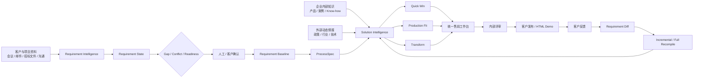

# DCForge

> **AI for Process · To B 直客售前智能协同工作台**  
> 将分散的客户需求、企业知识、历史方案与外部情报，锻造成可追溯、可确认、可复用、可发布、可持续迭代的客户解决方案。

**DCForge = Digital China Solution Forge**。  
> Forge 意为“锻造”：我们不让大模型凭空写方案，而是让 AI 在客户事实、企业知识、业务约束、历史资产和人工决策之上，锻造可信方案。

---

## 项目定位

DCForge 是面向神州数码 **“AI for Process：To B 直客售前流程的重新设计与实现”** 命题构建的企业级售前智能协同系统。

传统售前的核心矛盾并不是企业缺少产品或方案，而是：

- 客户需求分散在飞书沟通、会议纪要、邮件、招标文件和业务文档中；
- 同一需求会随项目推进持续变化，旧版本、最新口径与待确认信息容易混在一起；
- 企业已经沉淀大量产品、能力、案例和历史方案，但复用边界依赖个人经验；
- 预算、审批、安全、数据出域、系统兼容等硬约束经常发现得太晚；
- 静态 PPT 很难让客户看到真实业务流程、AI 与人的分工、审批节点和异常处理；
- 客户反馈后通常需要重新修改整套需求、架构图、流程图和演示材料，版本影响难以追踪。

DCForge 将这一过程重构为一条持续运行的 AI for Process 链路：

```text
客户与项目资料
    ↓
Requirement Intelligence
    ↓
人工 / 客户确认
    ↓
Requirement Baseline
    ↓
ProcessSpec
    ↓
企业知识 / 历史方案 / 外部情报
    ↓
Solution Intelligence
    ↓
Quick Win / Production Fit / Transform
    ↓
内部评审
    ↓
客户发布 / HTML Demo
    ↓
客户反馈
    ↓
Requirement Diff → Incremental / Full Recompile
    └──────────────────────────────↺
```

DCForge 的目标不是“让 AI 帮售前写一份更快的 PPT”，而是让售前过程具备 **状态、证据、版本、工具、资产和反馈闭环**。

---

## 为什么不是普通 Chatbot

DCForge 把 AI 的角色从“回答问题”升级为“参与流程运行”。

| 传统生成式 AI | DCForge |
|---|---|
| 一次性读取 Prompt | 持续维护项目状态与需求版本 |
| 自然语言总结 | Requirement Truth |
| 模型自由生成方案 | Solution-as-Code |
| 主要依赖模型记忆 | 企业知识 + Solution Asset + MCP Tool |
| 只输出一个答案 | Quick Win / Production Fit / Transform 三档策略 |
| 约束容易在文案中遗漏 | Hard Gate + 确定性约束校验 |
| 客户只能看 PPT | 售前工作台 + 客户发布页 + 可下载 HTML |
| 客户改需求后重新生成 | Requirement Diff + 增量 / 全量重编译 |
| AI 容易越过责任边界 | Human Gate 保留需求确认、审批、评审与发布 |

---

## 核心架构


```mermaid
flowchart LR
    A[客户与项目资料<br/>会议 / 邮件 / 招标文件 / 沟通] --> B[Requirement Intelligence]
    B --> C[Requirement State]
    C --> D{Gap / Conflict / Readiness}
    D --> E[人工 / 客户确认]
    E --> F[Requirement Baseline]
    F --> G[ProcessSpec]

    K1[企业内部知识<br/>产品 / 案例 / Know-how] --> H[Solution Intelligence]
    K2[外部动态情报<br/>政策 / 行业 / 技术] --> H
    G --> H

    H --> I1[Quick Win]
    H --> I2[Production Fit]
    H --> I3[Transform]
    I1 --> J[统一售前工作台]
    I2 --> J
    I3 --> J

    J --> R[内部评审]
    R --> P[客户发布 / HTML Demo]
    P --> FB[客户反馈]
    FB --> DF[Requirement Diff]
    DF --> RC[Incremental / Full Recompile]
    RC --> H
```

系统由两个核心智能引擎和一套统一售前运行平台组成：

1. **Requirement Intelligence Engine**：回答“客户到底要什么？”
2. **Solution Intelligence Engine**：回答“基于已确认需求，我们应该给客户什么？”
3. **Unified Presales Workspace**：把需求、研究、方案、评审、发布和反馈真正跑成业务流程。

---

# 1. Requirement Intelligence Engine

## 1.1 多源客户上下文

系统面向真实 To B 售前资料，而不是只分析一段聊天：

- 客户档案与组织上下文；
- 飞书 / 实时客户对话；
- 会议纪要；
- 客户邮件；
- 历史沟通；
- 招标文件；
- 需求说明与客户附件；
- CRM / 项目状态；
- 销售与售前备注。

客户事实、企业内部知识和外部情报采用不同 Truth Boundary：

- **客户来源**可以形成 Requirement Candidate；
- **内部知识**用于解释场景、提示缺口和后续方案复用，但不能自动变成当前客户事实；
- **外部情报**用于风险与约束提示，也不能自动写入客户 Requirement Truth。

## 1.2 LLM 理解 + 确定性真相管理

DCForge 不让大模型单独决定“什么是真需求”。

```text
Source Ingestion
    ↓
LLM Requirement Extraction
    ↓
Normalization / Atomization
    ↓
Requirement Candidate
    ↓
Deterministic Reducer
    ├─ Provenance
    ├─ Conflict
    ├─ Supersede
    └─ Version
    ↓
Requirement State
    ├─ Gap Detector
    ├─ Readiness Evaluator
    └─ Question Planner
```

大模型负责理解自然语言、提取语义和消解上下文；确定性组件负责版本、冲突、证据、状态、约束和正式编译。

## 1.3 Requirement Truth

每条需求不是一段“总结文本”，而是一个有生命周期的业务事实：

- 来源可追溯；
- Evidence Quote 可定位；
- extracted / inferred 明确区分；
- pending / conflicted / confirmed 等状态可管理；
- 客户前后口径变化可形成 supersede / version 链；
- 不允许 AI 自己宣布“客户已确认”；
- 正式方案只消费经过确认形成的 `RequirementBaseline`。

例如客户从：

```text
V1：10,000 套 / 108,000 元 / SOP 2027-04-01
```

调整为：

```text
V3：12,000 套 / 104,000 元 / SOP 2027-03-01
```

系统保留旧版本与来源关系，同时确保正式 Baseline 和下游方案使用最新确认口径，而不是静默覆盖历史事实。

## 1.4 Gap / Conflict / Readiness / Next Best Question

系统会持续判断：

- 哪些关键信息仍缺失；
- 哪些来源之间存在冲突；
- 当前需求是否足够进入初步方案或正式方案；
- 下一轮最值得向客户确认的一个问题是什么。

这样，AI 不只是“提取需求”，还参与持续的需求澄清过程。

## 1.5 上下文感知飞书需求 Agent

飞书客户 Agent 会结合：

- 当前客户回答；
- 历史问答；
- 当前 Requirement State；
- 待澄清问题；
- Requirement Skill；

规划下一轮回复。

它能够理解“暂时没有”“不知道”“这个一般怎么做”等依赖上下文的短回答，避免重复追问，并根据组织属性和采购场景动态选择 Requirement Skill。

---

# 2. Solution Intelligence Engine

DCForge 的方案生成不是“让大模型从零写三篇方案”。

正式链路为：

```text
ProcessSpec
    ↓
Action / AI Gene
    ↓
Solution Asset Retrieval
    ↓
Hard Gate
    ↓
Fit Assessment
    ↓
Reuse Decision
    ↓
Solution Intelligence Compiler
    ├─ Quick Win
    ├─ Production Fit
    └─ Transform
    ↓
DemoBlueprint
```

## 2.1 Solution-as-Code

企业历史方案被视为可检索、可解释、可组合的 `SolutionAsset`，而不是只能人工打开阅读的 PPT。

系统围绕 Action / AI Gene 描述业务动作所需的：

- Role；
- Object；
- Data & Knowledge；
- Technology；
- Standards & Rules；
- Tools；
- Input / Output；
- Risk；
- Evidence。

然后与企业历史能力和方案资产进行匹配。

## 2.2 可解释复用

每个方案模块最终必须落入明确的复用结论：

- `direct_reuse`：直接复用；
- `configuration`：通过配置适配；
- `customization`：需要客户化开发；
- `unavailable`：当前能力不可用。

这使“找到一个类似案例”与“这个模块真的能复用”成为两件不同的事情。

## 2.3 Hard Gate First

安全、审批、数据、预算、时间、风险等硬约束先于 Fit Score。

如果历史方案不满足客户关键约束，即使语义相似度很高，也不能被包装成“推荐方案”。

## 2.4 三档交付策略

同一份确认需求会编译为三种不同的交付策略：

- **Quick Win**：快速验证、最小改造、优先复用已有能力；
- **Production Fit**：兼顾落地、风险、系统边界与生产适配；
- **Transform**：围绕目标流程进行更完整的流程重构与系统协同。

三套方案不是三篇自由生成的营销文案，而是基于同一 Requirement Baseline 和能力资产形成的不同交付策略。

## 2.5 DemoBlueprint

方案不仅包含“写给客户看的内容”，还输出可执行/可演示的流程蓝图：

- 目标流程节点；
- AI / Human / System 执行角色；
- Human Gate；
- 系统交接；
- 输入输出；
- 指标与验证点。

这使 DCForge 能够把传统“死 PPT”进一步升级成可体验 Demo。

---

# 3. 统一售前工作台

DCForge 已将原独立调试 Console 收敛进统一 Vue 3 + Vite 前端。

统一售前工作台覆盖：

```text
客户机会 / 项目建立
    ↓
需求分析 / 客户确认
    ↓
资料与研究
    ↓
企业知识 / 案例检索
    ↓
三套方案成果草稿
    ↓
方案选择 / 结构化编辑
    ↓
内部评审
    ↓
客户发布
    ↓
客户反馈与迭代
```

核心页面：

- **内部门户**：系统入口、智能引擎控制台、Tool / Skill 配置；
- **统一售前工作台**：项目总览、资料研究、方案编排、评审发布；
- **客户中心**：通过专属 Access ID + Token 访问当前正式发布的一套方案；
- **HTML Deliverable**：生成可直接展示和下载的客户方案 HTML。

对内与对外严格区分：

- 内部员工可以看到三套候选方案、评审和修订记录；
- 客户页面只展示已经选中、已批准、已发布的一套方案；
- 客户反馈重新进入 Requirement State，而不是直接修改已确认事实。

---

# 4. 企业知识、案例与 MCP

## 4.1 企业知识

系统支持项目维度的知识检索与来源追踪，包括：

- 需求版本与原始资料；
- 历史案例；
- 供应商信息；
- 文档审查；
- 项目业务对象；
- 方案资产与引用证据。

查询同时受：

- `project_id`；
- `user_id`；
- `as_of` 时间点；
- ACL / 权限边界；

约束，避免把未来版本或无权限数据带入回答。

## 4.2 MCP Tool

DCForge 提供 MCP Dispatcher，使 AI Agent 能够按权限调用正式工具，例如：

- 企业知识 / 案例检索；
- 需求版本历史；
- 文档审查；
- 供应商分析；
- 业务对象追踪；
- 方案生成。

客户 Agent 与内部 Agent 使用不同的 Tool 白名单，客户侧配置不能扩大到内部 Tool。

## 4.3 Tool / Skill 配置

Agent 能力策略持久化在工作区 SQLite 中：

- `feishu-customer`；
- `feishu-internal`；
- 启用 Tool 白名单；
- 启用 Skill 白名单；
- 企业案例目录。

这使 Agent 从“代码里写死能力”升级为可配置的企业运行能力。

---

# 5. 客户参与与反馈闭环

客户项目可生成带访问令牌的专属 URL。

客户侧支持：

- 查看当前公开进度；
- 查看当前正式发布方案；
- 确认 / 拒绝需求项；
- 提交客户反馈；
- 查看最终 HTML Deliverable。

客户反馈不会直接覆盖 Requirement Baseline，而是进入新的需求版本：

```text
Customer Feedback
    ↓
Requirement Candidate
    ↓
Requirement State New Version
    ↓
Requirement Diff
    ↓
Impact Route
    ├─ No-op
    ├─ Incremental Recompile
    └─ Full Recompile
    ↓
New Solution Revision
```

因此 DCForge 的方案是“持续编译”的，而不是一次性交付后失去上下文。

---

# 6. 可靠性与企业级边界

DCForge 把“可信”视为方案生成的一部分，而不是生成后的人工补丁。

### 6.1 Evidence-backed

关键需求、资产和推荐都保留来源与 Evidence Reference。

### 6.2 Human-in-the-loop

AI 不替代：

- 客户需求最终确认；
- 人工审批；
- 法务签署 / 判废；
- 内部方案评审；
- 客户正式发布。

### 6.3 Version-aware

客户历史口径、当前确认口径和后续反馈保持独立版本与修改原因。

### 6.4 Value Discipline

方案价值严格区分：

- **Historical Value**：历史案例已经发生的效果；
- **Expected Value**：对当前客户的方案预期；
- **Verified Value**：当前客户环境实际运行后的测量结果。

DCForge 不把历史案例成绩冒充当前客户已实现结果。

### 6.5 数据与演示声明

仓库中用于比赛验收和演示的汽车采购、供应商、合同、评分、未来事件等业务数据均为 `synthetic_demo` / 模拟数据，不代表真实客户生产数据或实际经营成果。

---

# 7. Golden Domain：智能招采

智能招采是 DCForge 当前最完整的 Golden Domain。

围绕大型汽车制造企业采购场景，系统覆盖：

- 采购需求版本；
- 预算 / SOP / 数量 / 技术规格；
- SRM / ERP / OA / 合同管理平台边界；
- 供应商准入与双供应源；
- 数据权限与证据追踪；
- 招标 / 合同文档审查；
- 人工审批与法务边界；
- 企业知识与历史方案复用；
- 三档解决方案；
- 内部评审；
- 客户发布；
- 客户反馈后的 Requirement Diff 与方案重编译。

仓库同时保留多个 `synthetic_demo` 项目与企业全过程知识数据，用于权限、时间版本、RAG、方案生成和安全边界测试。

> 更多比赛背景、方案故事和业务材料见：[`DCForge_比赛项目补充材料.pdf`](./DCForge_比赛项目补充材料.pdf)

---

# 8. 技术栈

| 层 | 技术 |
|---|---|
| Backend | Python 3.11+, FastAPI, Pydantic |
| Frontend | Vue 3, Vite, Ant Design Vue, Vue Flow |
| Persistence | SQLite（运行数据统一存放于 Git 仓库外） |
| AI | OpenAI-compatible LLM Provider |
| Agent | Requirement Agent / Solution Agent / Enterprise Assistant |
| Tooling | MCP JSON-RPC / stdio |
| Integration | Feishu Bot / Event / Long Connection |
| Testing | pytest + Node Test + Vite Build |

---

# 9. 项目结构

```text
dc-forge/
├─ backend/app/
│  ├─ contracts/                 # 严格公共合同
│  ├─ process/                   # Requirement Intelligence
│  ├─ requirement_change/        # Generic Customer Requirement Change
│  ├─ internal_console/          # 内部智能引擎服务
│  └─ solution/
│     ├─ solution_intelligence_compiler.py
│     ├─ presales_orchestration.py
│     ├─ customer_engagement.py
│     ├─ workspace_database.py
│     ├─ agent_configuration.py
│     ├─ enterprise_portal.py
│     ├─ enterprise_assistant.py
│     ├─ mcp_server.py
│     ├─ feishu_bot.py
│     ├─ feishu_requirement.py
│     └─ api.py
│
├─ frontend/
│  ├─ src/
│  │  ├─ components/             # 统一门户 / Intelligence Console
│  │  ├─ presales/               # 统一售前工作台
│  │  └─ customer/               # 客户交互中心
│  ├─ tests/
│  └─ vite.config.js
│
├─ data/
│  ├─ requirement_skills/        # Requirement Skill
│  └─ ...                        # 方案资产 / fixture / 测试数据
│
├─ spec/                         # 冻结规格与产品演进规格
├─ tests/                        # 后端与跨模块回归
├─ output/                       # 比赛交付 / 验收产物
├─ docs/                         # 联调和工程文档
├─ .env.example
├─ requirements.txt
└─ README.md
```

关键规格：

- `spec/Requirement_Intelligence_Engine_v1.0_FROZEN.md`
- `spec/B-M8_Solution_Intelligence_Engine_v1.0_FROZEN.md`
- `spec/R-CHANGE1_Generic_Customer_Requirement_Change_Workflow_v1.0_FROZEN.md`
- `spec/PLATFORM-M1-internal-external-convergence.md`
- `spec/AGENT-M1-context-aware-requirement-dialogue.md`

---

# 10. 快速开始

## 10.1 环境要求

- Git
- Python 3.11+
- Node.js + npm（需兼容 Vite 7）

## 10.2 克隆

```bash
git clone https://github.com/pengfeidu09-tech/dc-forge.git
cd dc-forge
```

## 10.3 Python 环境

```bash
python -m venv .venv
```

Windows PowerShell：

```powershell
.\.venv\Scripts\Activate.ps1
pip install -r requirements.txt
```

macOS / Linux：

```bash
source .venv/bin/activate
pip install -r requirements.txt
```

## 10.4 前端依赖

```bash
cd frontend
npm ci
cd ..
```

---

# 11. 运行配置

## 11.1 工作区数据库

正式运行时业务状态统一写入 SQLite：

```text
DCFORGE_DATABASE_PATH=/path/outside/git/workspace.sqlite3
```

**数据库必须位于 Git 工作树之外。**

Windows 示例：

```powershell
$env:DCFORGE_DATABASE_PATH = "D:\dcforge_runtime\workspace.sqlite3"
```

## 11.2 开启 Intelligence Console

```powershell
$env:DCFORGE_ENABLE_INTERNAL_CONSOLE = "1"
```

macOS / Linux：

```bash
export DCFORGE_ENABLE_INTERNAL_CONSOLE=1
```

## 11.3 LLM

配置 OpenAI-compatible Provider：

```powershell
$env:LLM_API_KEY = "your-api-key"
$env:LLM_BASE_URL = "https://your-openai-compatible-endpoint/v1"
$env:LLM_MODEL = "your-model"
```

不要把 API Key、SQLite 数据库或运行时 Secret 提交到 Git。

## 11.4 飞书（可选）

参考 `.env.example` 配置：

```text
FEISHU_APP_ID
FEISHU_APP_SECRET
FEISHU_ALLOWED_OPEN_ID
FEISHU_INTERNAL_OPEN_IDS
FEISHU_VERIFICATION_TOKEN
FEISHU_API_BASE_URL
```

飞书 QR setup / 长连接：

```bash
python -m backend.app.solution.feishu_setup setup --listen
```

---

# 12. 启动

## 12.1 Backend

仓库根目录：

```bash
python -m uvicorn backend.app.main:app --host 127.0.0.1 --port 8000
```

健康检查：

```text
http://127.0.0.1:8000/health
```

Swagger：

```text
http://127.0.0.1:8000/docs
```

## 12.2 Frontend Dev

```bash
cd frontend
npm run dev
```

默认开发入口：

```text
http://localhost:5173/
```

主要页面：

```text
内部门户 / Intelligence Console
http://localhost:5173/

统一售前工作台
http://localhost:5173/presales/workbench/

客户中心静态入口
http://localhost:5173/customer/engagement/
```

客户正式访问链接由后端生成，形式为：

```text
/customer/engagement/{access_id}
```

并使用客户 Access Token 获取项目数据。

## 12.3 Production Build

```bash
cd frontend
npm run build
cd ..
```

构建后的 `frontend/dist` 可由 FastAPI 同源托管。

---

# 13. MCP

启动 stdio MCP Server：

```bash
python -m backend.app.solution.mcp_server
```

HTTP JSON-RPC 入口：

```text
POST /mcp
```

MCP 工具受项目、角色、时间点和 Agent Tool 白名单约束。

---

# 14. 主要 API

完整接口以 Swagger `/docs` 为准。

### Solution Intelligence

```text
POST /compile-solution-v2
POST /recompile-solution-v2
POST /review-solution
POST /agent/solution
POST /agent/chat
```

### Requirement Intelligence

```text
POST /requirement/compile-process-spec
POST /requirement/diff
POST /requirement/route-diff
```

### Enterprise Knowledge

```text
GET  /enterprise/projects
GET  /enterprise/projects/{project_id}/search
GET  /enterprise/projects/{project_id}/requirements/{requirement_id}/history
GET  /enterprise/projects/{project_id}/suppliers
GET  /enterprise/projects/{project_id}/document-reviews
POST /enterprise/assistant
```

### Presales Orchestration

```text
/presales/projects/*
/presales/knowledge/*
/presales/agent-config/*
```

支持项目建立、资料录入、研究、方案草稿、三方案选择、结构化编辑、内部评审和客户发布。

### Customer Engagement

```text
GET  /customer/engagement/{access_id}
GET  /customer/engagement/{access_id}/data
GET  /customer/engagement/{access_id}/deliverable
POST /customer/engagement/{access_id}/confirm
POST /customer/engagement/{access_id}/feedback
```

### Feishu

```text
POST /integrations/feishu/events
```

---

# 15. 测试与验收

Backend：

```bash
pytest -q
```

Frontend：

```bash
cd frontend
npm test
npm run build
```

Diff hygiene：

```bash
git diff --check
```

项目已经建立覆盖以下链路的回归测试：

- Requirement contracts；
- Requirement extraction / reducer / gap / conflict / readiness；
- confirmation / baseline / version / diff；
- ProcessSpec handoff；
- Solution Intelligence；
- DemoBlueprint；
- Generic Requirement Change；
- Presales Orchestration；
- Customer Engagement；
- Enterprise Knowledge / MCP；
- Feishu Agent；
- Agent Tool / Skill configuration；
- Unified Frontend navigation。

比赛提交前已完成完整网页 E2E 验收：

```text
客户资料
→ AI 需求分析
→ Gap / Conflict
→ 人工确认
→ Requirement Baseline
→ ProcessSpec
→ 企业知识 / 案例检索
→ Quick Win / Production Fit / Transform
→ 内部评审
→ 客户发布
→ 可下载 HTML
→ 客户反馈
→ Requirement Diff
→ Solution Recompile
```

---

# 16. 设计原则

DCForge 在实现过程中坚持以下原则：

1. **AI 负责理解，确定性系统负责业务真相。**
2. **内部知识不能自动变成客户事实。**
3. **Hard Gate 先于相似度与 Fit Score。**
4. **AI 不替代需要承担责任的人工决策。**
5. **历史案例效果不能冒充当前客户已实现结果。**
6. **客户反馈进入版本链，而不是静默覆盖。**
7. **企业能力必须可复用、可解释、可追溯。**
8. **方案最终要能被体验，而不只是被阅读。**

---

# 17. 从汽车招采走向更多行业

汽车智能招采是当前 Golden Domain，但 DCForge 的核心引擎并不绑定汽车行业。

跨行业扩展主要替换：

```text
Requirement Skill
+ Enterprise Knowledge
+ Industry Rules
+ Solution Asset
+ Tool / Connector
```

而以下主链保持不变：

```text
Requirement
→ Process
→ Solution
→ Review
→ Publish
→ Feedback
→ Recompile
```

因此平台可以继续扩展到零售、金融、医疗、政企、教育、运营商等不同价值链场景。

---

## 项目一句话

> **DCForge 让 AI 把分散的客户需求和企业知识锻造成可验证、可迭代的 To B 售前解决方案。**

**不是让 AI 写一份方案，而是让 AI 参与方案从需求形成到客户反馈的全过程。**
